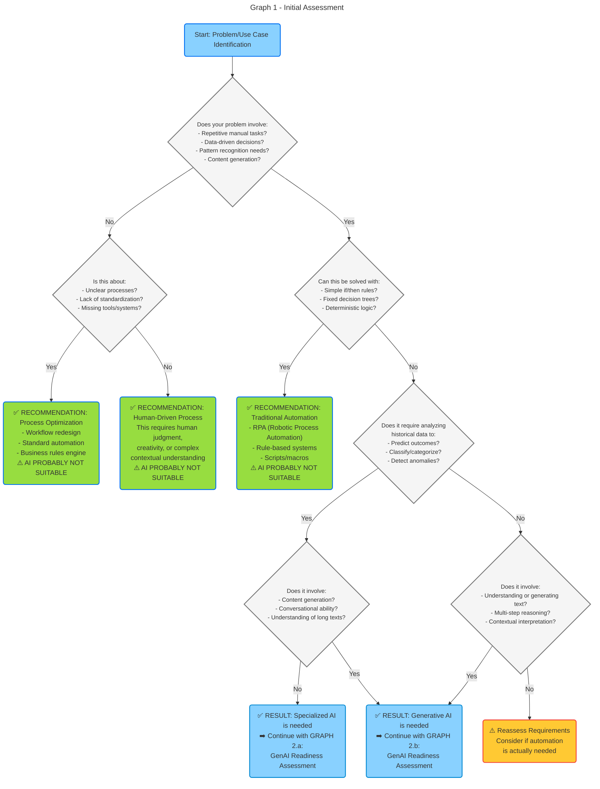
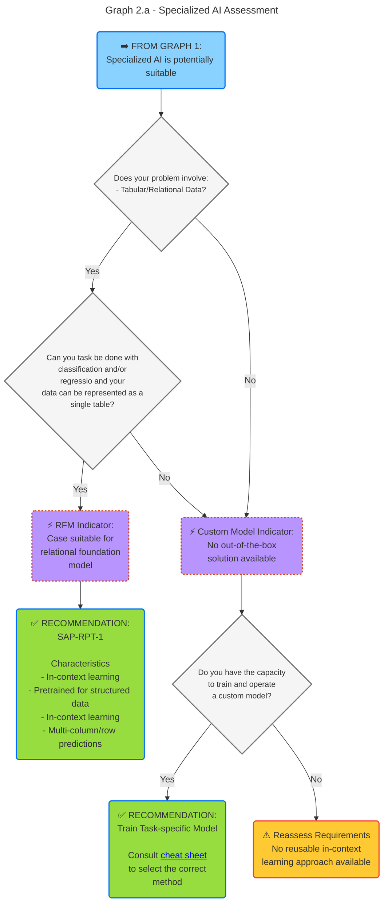
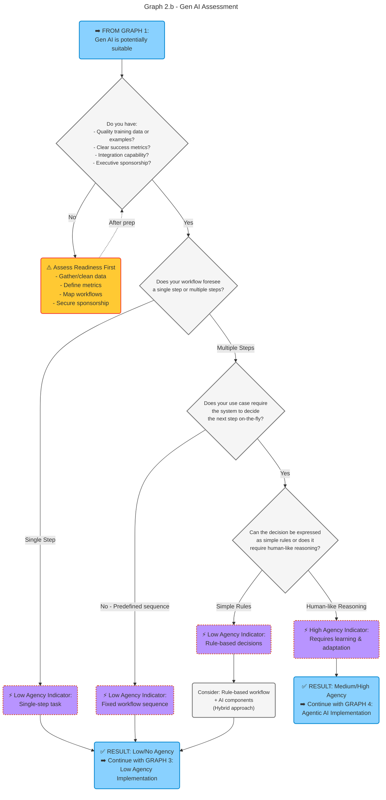
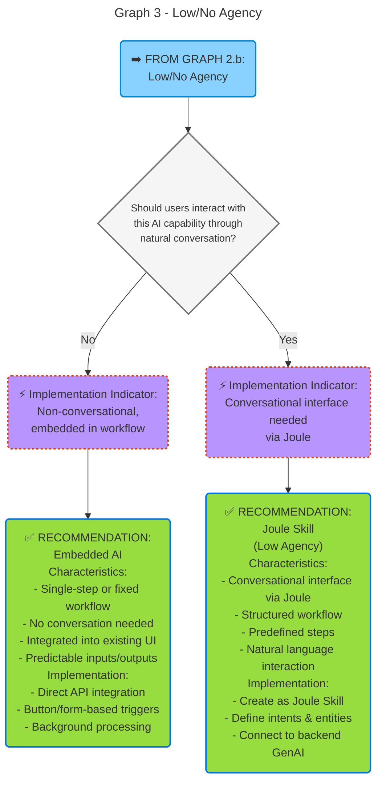
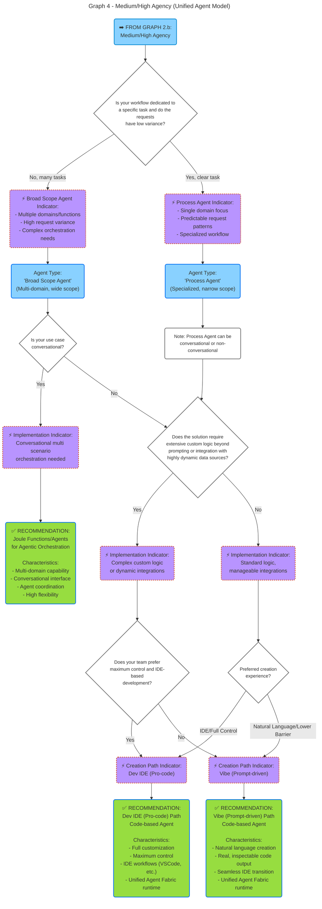

# SAP AI Golden Path source snapshot

> SAP source text, assembled from eight pages at a pinned commit. Copied 2026-09-22; the pages declare a content-update date of 2026-04-23. This is reference material, not a claim of current product availability. See [SOURCES.md](SOURCES.md#ai-golden-path) for provenance and conversion details.

Text-only copy: image embeds are replaced by deliberate source links; Mermaid decision trees and code examples remain as text. Page-specific prose and product names are preserved, including older SAP-RPT-1 wording. These examples are not instructions for the Advisor to execute.

## Contents

- [SAP's AI Golden Path](#saps-ai-golden-path)
- [Technology Decision Tree for AI](#technology-decision-tree-for-ai)
- [Classic ML Scenarios](#classic-ml-scenarios)
- [GenAI Applications](#genai-applications)
- [Joule Skills](#joule-skills)
- [Predictive & Tabular AI](#predictive--tabular-ai)
- [Document AI](#document-ai)
- [Build AI Agents on SAP BTP](#build-ai-agents-on-sap-btp)

## SAP's AI Golden Path

Source: [readme.md](https://github.com/SAP/architecture-center/blob/b54c38015ad3ef92453e0437da05f8d2e5ca35f2/docs/golden-path/ai-golden-path/readme.md) · declared update 2026-04-23.

The **SAP's AI Golden Path** is the starting point for developing AI applications across the SAP ecosystem. It contains **recommendations**, **best practices**, and **tutorials** to help you understand the AI technology stack, identify
suitable tools and services, and design, deliver, and extend enterprise-grade AI solutions on SAP technology.

It serves as a central entry point into our approach for building AI-native applications, covering everything from data
and AI foundation services to agentic architectures and **Joule**.

### Is This Guide for You?

* If you're an **architect or AI project lead**, this guide helps you to plan the architecture of your AI application
  and choose the right AI capabilities, data layers, and runtime services within the SAP ecosystem.

* If you're a **developer**, this guide helps you to select the appropriate tools, SDKs, and frameworks for building and
  integrating AI features.

* If you're a **product manager**, this guide helps you to understand the AI development lifecycle, available technologies, and best practices for delivering AI use cases.

### References

Before starting your AI development journey, you may want to familiarize yourself with the following documents:

* **[SAP BTP Developer Guide](https://help.sap.com/docs/btp/btp-developers-guide/btp-developers-guide)**
  Starting point for developing business applications on SAP Business Technology Platform (BTP). It contains recommendations and best practices for
  development projects on SAP BTP.

### How to Use This Guide

Use this guide to navigate the **AI development lifecycle**, from understanding the available technology to implementing
and scaling AI use cases.

#### Understand Available Technology

[Illustration omitted: Architecture Overview](https://github.com/SAP/architecture-center/blob/b54c38015ad3ef92453e0437da05f8d2e5ca35f2/docs/golden-path/ai-golden-path/images/overview_architecture.svg)

The first step toward building an AI application is understanding the **technology stack** available within SAP. This
includes:

* **Agent Layer** — including content-based AI Agents built with **Joule Studio**, code-based AI Agents built with  open-source frameworks and SAP's **generative AI hub**, **Joule**, and **agent tools (MCP)**.
* **AI Layer** — powered by **AI Core** (including **generative AI hub**), and **SAP HANA Cloud** (including Vector Engine, Knowledge Graph Engine, PAL, SparkML), enabling model training, orchestration, and interaction
  through generative and agentic interfaces.
* **Data Layer** — powered by **SAP HANA Cloud**, **Business Data Cloud**, and partner
  technologies like **Databricks** and **Snowflake** for advanced analytics and data science.

See [Technology Decision Tree](#technology-decision-tree-for-ai) for details.

#### Select the Right AI Approach

Choosing the correct AI approach depends on the use case and business problem:

* **Agentic Workflows & AI Agents** – Context-aware automation, orchestration, and dynamic decision-making.
* **Generative AI & LLMs** – Natural language, summarization, and conversational use cases.
* **Classic Machine Learning (ML) on AI Core** – Predictive analytics, optimization, classification.
* **Relational Foundation Models** – Structured data, tabular predictions.

See [Decide on an approach](#technology-decision-tree-for-ai) for detailed recommendations.

#### Develop AI Use Cases

AI development follows a **design-led, iterative process** that ensures business value and technical feasibility. This
guide structures recommendations across the key development phases:

[Illustration omitted: AI Development Process](https://github.com/SAP/architecture-center/blob/b54c38015ad3ef92453e0437da05f8d2e5ca35f2/docs/golden-path/ai-golden-path/images/dev_process.svg)

This guide mainly focuses on the **Design**, **Deliver**, and **Run & Scale** phases.

* **Explore, Discover** — Identify business challenges suitable for AI, evaluate feasibility, and define success
  metrics or evaluations (evals).
* **Design** — Create an AI architecture and decide between ML, LLM, or agentic approaches.
* **Deliver** — Set up the environment (SAP BTP, Joule, AI Core), develop and deploy AI applications, and integrate them
  into existing processes.
* **Run & Scale** — Run the application to provide business value.
* **Evaluate & Improve** — Measure accuracy, performance, and business outcomes; continuously enhance through structured
  evaluations.
* **Extend** — Build on top of existing applications or agents, integrating with partner ecosystems and third-party
  solutions.

Get started with building in the [Build and Deliver](#classic-ml-scenarios) section.

## Technology Decision Tree for AI

Source: [1-technology-overview/readme.md](https://github.com/SAP/architecture-center/blob/b54c38015ad3ef92453e0437da05f8d2e5ca35f2/docs/golden-path/ai-golden-path/1-technology-overview/readme.md) · declared update 2026-04-23.

### When to use AI

The journey to successful AI implementation begins with a sobering reality: 95% of enterprise AI initiatives deliver zero measurable return. Success isn't determined by model quality or regulatory constraints — it is determined by the value provided. Organizations must move beyond the technology hype and, instead, ground their AI exploration in concrete business problems where the technology's strengths genuinely align with operational needs.

Evaluate potential AI initiatives across four dimensions:

- *Business Impact*: Does this problem create measurable cost, delay, or quality issues?
- *Data Availability*: Is quality training and evaluation data available or can it be collected?
- *Technical Feasibility*: Can AI systems learn, adapt, and integrate with existing workflows?
- *Organizational Readiness*: Are stakeholders prepared for adoption and change management?

Before pursuing an AI solution, answer these questions honestly:

- Where do employees spend disproportionate time on repetitive, rule-based tasks?
- Where do delays occur due to information bottlenecks or manual data synthesis?
- Which decisions require rapid analysis of complex data patterns?
- Is this a genuine operational pain point or trend-chasing?

Double-check if AI really is a feasible approach for the problem you identified:

- Would process optimization or traditional automation solve this more effectively?
- Does the problem require pattern recognition, prediction, or content generation at scale?
- Will the AI system integrate smoothly with existing workflows, or create friction?
- Can the solution learn from feedback and adapt as processes evolve?

Proceed with AI if:

- The problem involves repetitive cognitive tasks requiring speed, consistency, and scale.
- You have identified an approach with learning capabilities and deep workflow integration.
- You can start simple/narrow and expand based on demonstrated value.

Be careful using AI when:

- Process redesign would solve the core issue more effectively.
- You are pursuing AI to match competitors rather than solve a real pain point.
- The problem requires judgment, empathy, or complex contextual understanding current AI cannot provide.
- Implementation timeline or cost exceeds the potential operational benefit.

### Choosing the Right Approach

Building AI-powered systems today involves a growing range of tools and paradigms. Each has its strengths, trade-offs, and ideal scenarios. Understanding when to use **classic machine learning (ML)**, **relational foundation models (e.g., `sap-rpt-1`)**, **large language models (LLMs)**, **agentic workflows**, or **AI agents** is therefore essential.

#### 1. Relational Foundation Models (e.g., `sap-rpt-1`)

**When to use:**

* You have **structured data** (e.g., tabular/relational structure, including numerical, textual or categorical fields).
* You can formulate your problem as a task with **clearly defined output** (e.g., a label, score, numeric value).
* You want high **predictive accuracy / prediction quality**.
* You have historical data or another way of creating labeled reference examples.
* Your problem can be expressed as a classification, regression or scoring problem (for the time being `sap-rpt-1` does not fully support time series forecasting or clustering, for example)
* You have successfully tested that `sap-rpt-1` can deal with your task (conduct experiments via the [SAP-RPT-1 (External) Playground](https://rpt.cloud.sap/) for productive state)

**Examples:**

* Predicting customer churn or credit risk.
* Predicting payment delays.
* Completing sales orders or other missing data.
* Recommending offers.

**Why choose RPT:**
It offers instant predictive insights from structured business data through in-context learning that eliminates the need for costly and time-consuming model training while typically deliverying improved prediction quality compared to classic AI models, and increased flexibility, e.g., regarding changing data or data models.

#### 2. Classic Machine Learning (ML)

**When to use:**

* You have **structured data** (e.g., tabular/relational structure, with mostly numerical or categorical fields).
* You can formulate your problem as a task with **clearly defined output** (e.g., a label, score, numeric value).
* You can **engineer features** and have historical data for training.
* Interpretability, explainability, and performance tuning are important.
* For **classification/regression**: It is recommended to first evaluate `sap-rpt-1` for classification/regression, as benchmarks show strong performance with lower engineering effort. Only move away if it cannot meet constraints (e.g. latency  &lt;200 ms, data locality, context limits, GPU availability). For **time series, anomaly detection, clustering**: use classic ML (e.g. HANA PAL) as the default.
* You can bear costs and complexity of lifecycle management of per-customer trained models, or you do not have per-customer trained model.
* Processing needs to happen close to the data via in-database ML.

**Examples:**

* Detecting anomalies in sensor data.
* Forecasting demand over a longer period of time.
* Ranking search results
* Recommendations an item from a large catalog.

**Why choose classic ML:**
It can offer very low latency predictions, and high control over data and models. Use it when you need maximum control over model properties, and are willing to bear the additional model lifecycle management efforts across multiple customers and use cases.

#### 3. Large Language Models LLMs, including Retrieval Augmented Generation

**When to use:**

* You work with **unstructured or semi-structured data** (text, documents, conversations, code).
* The task involves **language understanding, generation, or transformation**.
* You need **semantic reasoning** over diverse inputs without retraining.
* The task requires **limited and programmable orchestration** with other tools (e.g. only provide documents for grounding)

**Examples:**

* Summarizing, rewriting, or translating text or semi-structured data.
* Extracting structured information from documents or semi-structured data.
* Support conversational interfaces or question answering, e.g. via a Joule function.
* Code generation or documentation assistance.
* Create semantic representations of text using embedding models, to support similarity search

**Why choose LLMs:**
They provide flexible, high-level reasoning without custom model training. Use them when language processing is required and a *single call to an LLM*, possible with a RAG step is sufficient

#### 4. AI Agents

AI agents are autonomous systems that can make decisions, plan actions, execute tasks, and adapt over time. They go beyond single LLM calls by maintaining state, using tools, and orchestrating multi-step reasoning across multiple tasks and data sources.

**When to use AI Agents:**

* You want **multi-step reasoning or decision making** across multiple tasks, tools, and data sources.
* You require **planning, tool use, or iterative refinement** rather than a single inference call.
* The system must **act autonomously**, make decisions over time, and **integrate reasoning with external actions**.
* You need **composable AI behaviors** that can be orchestrated (e.g., chaining LLM calls, calling APIs, using business rules).
* You require **persistent memory**, **replayability**, and **auditability**.
* You need control and flexibility on the agent flow (e.g., pre/post-processing, error handling, reflection steps).
* You require fine-grained control over memory and tool use.

**Examples:**

* Coordinate tasks between humans, LLMs, and external systems.
* LLM chaining and multi-agent orchestration.
* Constraint-driven, goal-oriented, and context-aware execution of tasks.
* Running experiments, managing business processes, or controlling digital systems.
* Research automation, conversation management, and complex workflows.

**Why choose AI Agents:**
Use them when the problem requires **reasoning over time, calling external tools, or coordinating multiple AI and non-AI tasks**. Agents are ideal when the system must act autonomously, integrate reasoning with external actions, and maintain state across interactions.

**Get started:** [Build AI Agents on SAP BTP](#build-ai-agents-on-sap-btp)

### Technology Assessment Framework

Selecting the right approach for implementing AI solutions requires careful evaluation of your use case, technical requirements, and organizational capabilities. This comprehensive decision framework guides you through a structured assessment process, helping you determine whether your problem truly requires AI, and if so, which type of AI solution best fits your needs. The framework is organized into progressive decision trees that narrow down from broad feasibility questions to specific implementation recommendations, ensuring you invest in the most appropriate technology for your specific scenario.

The decision trees work sequentially: you'll start with basic qualification questions to determine if AI is even necessary, then proceed through specialized assessments based on whether you need traditional machine learning or generative AI, and finally arrive at concrete implementation recommendations including specific platforms and tools. Each graph builds upon the results of the previous one, creating a clear path from problem identification to solution design.

#### Initial Assessment - Graph 1

Before investing in any AI solution, it's critical to establish whether your problem actually requires AI or if it can be better solved through traditional automation, process optimization, or standard business rules. This initial assessment helps you avoid the common pitfall of applying AI where simpler, more reliable, and cost-effective solutions would suffice. Graph 1 evaluates your use case against fundamental AI characteristics such as the need for pattern recognition, data-driven decision making, and the complexity of the logic required. By the end of this assessment, you'll know whether to proceed with AI exploration, implement traditional automation, or reconsider your approach entirely.



#### Specialized AI Assessment - Graph 2.a

If Graph 1 determined that your use case requires specialized AI (traditional machine learning rather than generative AI), this section helps you identify the most appropriate approach for your data and problem type. Specialized AI excels at tasks involving structured data analysis, classification, regression, and prediction based on historical patterns. Graph 2.a distinguishes between scenarios where you can leverage pretrained foundation models for tabular data versus cases requiring custom model development. This assessment is particularly relevant for use cases involving relational databases, numerical predictions, customer segmentation, fraud detection, and other structured data analytics challenges.


#### Gen AI Assessment - Graph 2.a

For use cases identified in Graph 1 as requiring generative AI capabilities—such as content generation, natural language understanding, multi-step reasoning, or conversational interfaces—this assessment evaluates your organizational readiness and determines the level of autonomy (agency) your solution requires. Generative AI implementations can range from simple single-step transformations to complex multi-step workflows with dynamic decision-making. Graph 2.b first ensures you have the necessary foundations in place (quality data, clear metrics, integration capabilities, and executive support) before classifying your use case by its agency requirements. Understanding whether your workflow involves predefined sequences or requires adaptive, human-like reasoning is crucial for selecting the right implementation approach in subsequent graphs.



#### Gen AI Non-Agent Assessment - Graph 3

When your generative AI use case requires low or no agency — meaning it follows predictable patterns with single-step operations or fixed multi-step sequences—the implementation approach becomes straightforward. Graph 3 focuses on a single but important distinction: whether your users need to interact with the AI through natural conversation or whether the capability can be embedded directly into existing workflows and user interfaces. This decision determines whether you should build a conversational Joule Skill or integrate the AI functionality as a background service triggered by buttons, forms, or automated processes. Both approaches leverage generative AI's power while maintaining predictable, controlled behavior suitable for production environments where consistency and reliability are paramount.



#### Gen AI Agent Assessment - Graph 4

AI agents represent the most sophisticated and autonomous category of generative AI solutions, capable of dynamic decision-making, multi-step reasoning, and adaptive behavior. Following the **unified target model**, all agents are now code-based, with two creation paths available: **Dev IDE (pro-code)** for maximum flexibility and control, or **Vibe (prompt-driven)** for a lower barrier to entry while still producing real, inspectable code. Both paths produce the same portable, versionable artifact deployed to the unified Agent Fabric runtime.

Graph 4 navigates the complexity of implementing AI agents by first distinguishing between process agents (specialized for specific tasks with predictable patterns) and broad-scope agents (handling multiple domains with high variance). The assessment then considers whether conversational interaction is required, the complexity of custom logic needed, and your team's technical preferences. These factors guide you to the appropriate creation path while ensuring all agents benefit from the unified runtime's consistency in lifecycle management, observability, and governance.



**References:**
- [Forbes: Why 95% Of AI Pilots Fail, And What Business Leaders Should Do Instead](https://www.forbes.com/sites/andreahill/2025/08/21/why-95-of-ai-pilots-fail-and-what-business-leaders-should-do-instead/)

## Classic ML Scenarios

Source: [2-build-and-deliver/2-classic-ml/readme.md](https://github.com/SAP/architecture-center/blob/b54c38015ad3ef92453e0437da05f8d2e5ca35f2/docs/golden-path/ai-golden-path/2-build-and-deliver/2-classic-ml/readme.md) · declared update 2026-04-23.

### What you will build

Machine Learning (ML) on SAP platforms enables organizations to build predictive and prescriptive analytics capabilities directly within their business applications. This guide covers three primary approaches:

- **Tabular AI with RPT-1** *(start here for classification and regression)*: Foundation model for predictive use cases on tabular data. No model training required — leverages in-context learning based on a globally pre-trained model. Available via AI Core and directly in HANA Cloud via SQL stored procedure.
- **Embedded ML with SAP HANA Cloud (PAL/APL)**: Train and deploy models directly in-database using built-in libraries. Preferred for time series, anomaly detection, clustering, and as a fallback for classification/regression when RPT-1 cannot meet specific operational requirements.
- **Custom ML with SAP AI Core**: Build, deploy, and serve custom ML models on Kubernetes infrastructure. Use when custom or customer-specific model training is required.

Whether you need in-database ML for real-time predictions or custom deep learning models with MLOps capabilities, SAP provides comprehensive infrastructure for the complete ML lifecycle — from data preparation and model training to deployment and monitoring in production environments.

### Prerequisites & setup

Before building ML solutions on SAP platforms, ensure your environment meets these requirements:

**For RPT-1:**

- **AI Core Access**: RPT-1 is available via AI Core's generative AI hub. See the AI Golden Path: How to build, deploy and run with RPT-1.
- **HANA Cloud (optional)**: RPT-1 is also callable directly via SQL stored procedure from HANA Cloud.

**For SAP HANA Cloud ML (PAL/APL):**

- **SAP HANA Cloud Instance**: Database instance with ML libraries enabled
- **Python Development Environment**: Python 3.8+ with hana-ml client library installed
- **Database Access**: HDI container or schema with appropriate ML permissions (AFL__SYS_AFL_AFLPAL_EXECUTE, AFL__SYS_AFL_APL_AREA_EXECUTE)
- **Data Access**: Connection to source systems or Business Data Cloud for training data

**For SAP AI Core ML:**

- **SAP BTP Account**: With SAP AI Core entitlement and resource plan
- **Docker Registry Access**: For containerizing training and serving applications
- **AI Core Credentials**: Service keys for authentication and API access
- **Development Tools**: Python/R for model development, Docker for containerization, Git for version control

**Resources:**

- **AI Golden Path: RPT-1** – How to build, deploy, and run with RPT-1
- **[Using Machine Learning Libraries (APL and PAL) in SAP HANA Cloud](https://help.sap.com/docs/hana-cloud/sap-hana-cloud-getting-started-guide/using-machine-learning-libraries-apl-and-pal-in-sap-hana-database)** – Official setup guide for enabling and using ML libraries
- **[SAP AI Core Service Guide](https://help.sap.com/docs/sap-ai-core/sap-ai-core-service-guide/what-is-sap-ai-core)** – Complete documentation for AI Core setup and configuration

### Architecture at a glance

For a comprehensive view of the AI technology stack and how ML capabilities integrate with SAP HANA's AI architecture, see the **[SAP AI Core documentation](https://help.sap.com/docs/sap-ai-core/sap-ai-core-service-guide/what-is-sap-ai-core)**.

SAP HANA provides three architectural patterns for ML deployment:

**Pattern 1: Tabular AI with RPT-1 (classification & regression)**
```
Feature Data → RPT-1 (AI Core / HANA Cloud SQL) → Predictions → Applications
               (no training; in-context learning)
```

**Pattern 2: Embedded ML with SAP HANA Cloud**
```
Data Sources → SAP HANA Cloud (PAL/APL) → Real-time Predictions → Applications
                      ↓
              In-Database Training
              (No data movement)
```

**Pattern 3: Custom ML with SAP AI Core**
```
Data Sources → Feature Engineering → AI Core Training → Model Registry
                                            ↓
                                    AI Core Serving → REST API → Applications
```

**Hybrid Pattern:**
```
SAP HANA Cloud (Feature Engineering) → AI Core (Training/Serving) → HANA (Prediction Storage)
                                                ↓
                                         Vector Engine (Semantic Search)
```

### Build

SAP provides three approaches for building ML solutions. For classification and regression, always evaluate RPT-1 first.

#### **Approach 1: Tabular AI with RPT-1** *(classification & regression — start here)*

RPT-1 is SAP's tabular foundation model for predictive AI. It requires no model training — it uses in-context learning to generate predictions from a globally pre-trained model, reading your labeled historical data rows at inference time as context.

**When to use RPT-1:**

- Classification or regression on tabular data
- Cold-start situations with limited historical training data
- Use cases where column names or cells contain textual/semantic content (RPT-1 understands these natively)
- Rapid prototyping without the overhead of a training pipeline

**Current limitations to be aware of:**

- Supports classification and regression only (not time series, clustering, anomaly detection)
- Context window limits: 2048 rows for RPT-1-small, 65,536 rows for RPT-1-large
- Latency: GPU-based inference; not suitable for &lt;200ms latency requirements
- Batch inferencing: current API is optimized for online (few-at-a-time) inference; batch object-store workflows are on the roadmap
- Explainability: native explainability is on the roadmap for Q2/2026
- GPU availability: verify GPU resource availability in your target data center in advance

**Resources:**

- **AI Golden Path: How to build, deploy and run with RPT-1** – Complete guide for RPT-1
- **RPT-1 Feedback** – Collected implementation experiences and known workarounds

#### **Approach 2: Embedded ML with SAP HANA Cloud (PAL/APL)**

Use for time series forecasting, anomaly detection, clustering, and other use cases not covered by RPT-1. For classification and regression, use this approach only when RPT-1 cannot meet your operational requirements (latency, data gravity, or specialized algorithm needs).

**Development Workflow:**

1. **Data Preparation**: Connect to SAP HANA Cloud and prepare training datasets using SQL or Python
2. **Model Selection**: Choose appropriate algorithms from PAL (classical ML) or APL (AutoML) libraries
3. **Model Training**: Train models directly in-database using hana-ml Python client or SQL procedures
4. **Model Validation**: Evaluate model performance with built-in metrics and validation techniques
5. **Model Persistence**: Store trained models as HANA objects for reuse and versioning

**Capabilities:**

- **In-Database Processing**: Train models where data resides, eliminating data movement and latency
- **Rich Algorithm Library**: Out of the box algorithms in PAL covering classification, regression, clustering, time series, and more
- **AutoML with APL**: Automated feature engineering, algorithm selection, and hyperparameter tuning
- **Python Integration**: Leverage hana-ml library for seamless Python-to-HANA workflows
- **Performance Optimization**: Leverage HANA's columnar storage and parallel processing for large-scale datasets

**Code Example - Classification with PAL:**

```python
# Example: PAL Random Forest via hana-ml Python client
from hana_ml import dataframe as hd
from hana_ml.algorithms.pal.trees import RDTClassifier

# Connect to HANA Cloud
conn = hd.ConnectionContext(address='<hana-host>', port=443, 
                             user='<user>', password='<password>')

# Load training data from HANA table
hdf_train = conn.table('CUSTOMER_CHURN_TRAIN')

# Train Random Forest in-database
rfc = RDTClassifier(n_estimators=100, max_depth=10, random_state=42)
rfc.fit(data=hdf_train, key='CUSTOMER_ID', label='CHURN')

# Predict on new data (also in-database)
hdf_test = conn.table('CUSTOMER_CHURN_TEST')
predictions = rfc.predict(data=hdf_test, key='CUSTOMER_ID')

# Results stay in HANA - no data movement
predictions.collect()  # Only retrieve if needed
```

**Code Example - AutoML with APL:**

```sql
-- Example: APL AutoML for classification
CALL _SYS_AFL.APL_CREATE_MODEL_AND_TRAIN(
    CONFIG_TABLE,           -- Configuration (auto-detect settings)
    VAR_DESC_TABLE,         -- Variable descriptions
    'TRAINING_DATA',        -- Input training table
    'APL_MODEL'             -- Output model table
) WITH OVERVIEW;

-- Predict using trained model
CALL _SYS_AFL.APL_APPLY_MODEL(
    'APL_MODEL',            -- Trained model
    'TEST_DATA',            -- Input test data
    'PREDICTIONS'           -- Output predictions table
);
```

**Resources:**

- **[All-in-One Machine Learning in SAP HANA Cloud](https://community.sap.com/t5/technology-blog-posts-by-sap/new-machine-learning-features-in-sap-hana-cloud/ba-p/13671778)** – Comprehensive overview of ML capabilities and recent enhancements
- **[AutoML with SAP HANA Automated Predictive Library (APL)](https://learning.sap.com/courses/hana_apl)** – Complete course on AutoML features
- **[Developing AI Models with Python Machine Learning Client](https://learning.sap.com/courses/developing-ai-models-with-the-python-machine-learning-client-for-sap-hana-1)** – Hands-on training for hana-ml
- **[Machine Learning with SAP S/4HANA](https://blog.sap-press.com/machine-learning-with-sap-s4hana)** – Guide to embedded ML architecture in S/4HANA
- **[hana-ml-samples GitHub Repository](https://github.com/SAP-samples/hana-ml-samples)** – Official sample code and reference implementations

**Specialized Learning Paths:**

- **[Developing Classification Models](https://learning.sap.com/courses/developing-classification-models-with-the-python-machine-learning-client-for-sap-hana)** – Binary and multi-class classification techniques
- **[Developing Regression Models](https://learning.sap.com/courses/developing-regression-models-with-the-python-machine-learning-client-for-sap-hana)** – Linear, polynomial, and non-linear regression
- **[Developing Time Series Models](https://learning.sap.com/courses/developing-time-series-models-with-the-python-machine-learning-client-for-sap-hana)** – Forecasting and trend analysis
- **[Basic AutoML Tutorial](https://developers.sap.com/tutorials/hana-cloud-trial-basic-automl..html)** – Quick start guide for automated ML

#### **Approach 3: Custom ML with SAP AI Core**

Use when custom or customer-specific model training is required and foundation models cannot meet the use case needs.

**Development Workflow:**

1. **Model Development**: Build custom ML models using TensorFlow, PyTorch, scikit-learn, or other frameworks
2. **Containerization**: Package training and serving code as Docker images
3. **Workflow Definition**: Create YAML templates defining training executables and serving templates
4. **Model Training**: Execute training pipelines on AI Core's Kubernetes infrastructure
5. **Model Registration**: Store trained models in AI Core's artifact store
6. **Model Deployment**: Deploy models as REST API endpoints for inference
7. **Integration**: Consume model predictions from SAP and non-SAP applications

**Capabilities:**

- **Framework Flexibility**: Use any ML framework
- **Scalable Infrastructure**: Leverage Kubernetes for distributed training and elastic serving
- **MLOps Automation**: Version control for models, automated retraining pipelines, A/B testing
- **Multi-Model Serving**: Deploy multiple model versions simultaneously for comparison
- **API-Based Consumption**: RESTful endpoints for real-time and batch inference
- **Monitoring & Logging**: Track model performance, resource utilization, and inference latency

**Resources:**

- **[SAP Help - What is SAP AI Core](https://help.sap.com/docs/sap-ai-core/sap-ai-core-service-guide/what-is-sap-ai-core)**
- **[SAP Help - What is SAP AI Launchpad](https://help.sap.com/docs/ai-launchpad/sap-ai-launchpad/what-is-sap-ai-launchpad)**
- **[Learning How to Use SAP AI Core](https://learning.sap.com/learning-journeys/learning-how-to-use-the-sap-ai-core-service-on-sap-business-technology-platform)** – Complete learning journey covering training and serving
- **[Training and Deploying Custom AI Models in SAP](https://developers.sap.com/tutorials/ai-core-custom-llm.html)** – Guide for custom model deployment
- **[SAP AI Core Samples](https://github.com/SAP-samples/ai-core-samples)** – Sample notebooks and workflow templates for quick hands-on
- **[Predictive AI with SAP AI Core](https://developers.sap.com/group.ai-core-get-started-basics.html)** – Get started tutorial covering fundamentals and first workflows

### Deploy

**Deployment for RPT-1:**

RPT-1 requires no training pipeline. Deployment means providing your historical feature data as context rows at inference time. See the RPT-1 Golden Path for API integration details.

**Deployment for HANA PAL/APL:**

Models trained in HANA Cloud are automatically persisted as database objects and can be invoked directly via SQL or Python:

```python
# Model is already deployed in-database
# Simply call predict on new data
predictions = trained_model.predict(data=new_data, key='ID')
```

**Deployment for SAP AI Core:**

1. **Create Serving Template**: Define REST API endpoint configuration
2. **Deploy Model**: Use AI Core API or AI Launchpad to deploy model
3. **Monitor Endpoint**: Track inference latency, throughput, and errors
4. **Scale Resources**: Adjust replica count based on load

**Resources:**

- **[hana-ml BTP App Examples](https://github.com/SAP-samples/hana-ml-samples/tree/main/BTP-App)** – Reference implementations for deploying ML models in BTP applications
- **[SAP AI Core Deployment Guide](https://help.sap.com/docs/sap-ai-core/sap-ai-core-service-guide/deployment)** – Official documentation for model deployment workflows
- **[SAP AI Core Monitoring](https://help.sap.com/docs/sap-ai-core/sap-ai-core-service-guide/metrics)** – Official documentation for AI Core metrics and monitoring capabilities

### Run

**Integration with RPT-1:**

- **REST API via AI Core**: Consume predictions via HTTP from any application
- **HANA Cloud SQL**: Call RPT-1 via stored procedure directly from HANA applications
- **Online inference**: Current API is optimized for few-at-a-time predictions; batch object-store support is on the roadmap

**Integration with HANA PAL/APL Models:**

- **SQL Integration**: Call models directly from SQL queries in applications
- **Python Integration**: Use hana-ml client in BTP applications or custom services
- **Real-time Predictions**: Sub-10ms latency for in-database predictions
- **Batch Scoring**: Process millions of records in parallel

**Integration with AI Core Models:**

- **REST API**: Consume predictions via HTTP endpoints from any application
- **SAP AI Launchpad**: UI-based monitoring and inference testing
- **Batch Inference**: Submit large datasets for asynchronous processing
- **A/B Testing**: Route traffic between multiple model versions

**Hybrid Integration - Semantic Search Example:**

```sql
-- Create table with vector column for AI Core embeddings
CREATE TABLE PRODUCT_EMBEDDINGS (
    PRODUCT_ID NVARCHAR(50),
    EMBEDDING REAL_VECTOR(768),  -- 768-dimensional embedding from AI Core
    PRODUCT_NAME NVARCHAR(255)
);

-- Semantic search: Find similar products using HANA Vector Engine
SELECT TOP 10
    PRODUCT_ID,
    PRODUCT_NAME,
    COSINE_SIMILARITY(EMBEDDING, :query_embedding) AS SIMILARITY
FROM PRODUCT_EMBEDDINGS
WHERE COSINE_SIMILARITY(EMBEDDING, :query_embedding) > 0.7
ORDER BY SIMILARITY DESC;
```

**Resources:**

- **[HANA Vector Engine Guide](https://help.sap.com/docs/hana-cloud-database/sap-hana-cloud-sap-hana-database-vector-engine-guide/creating-text-embeddings-with-sap-ai-core?locale=en-US)** – Creating embeddings with AI Core for HANA semantic search

### Best Practices

| **Dos** | **Don'ts** |
|-------------|---------------|
| **Start with RPT-1** for classification and regression — it requires no training, handles textual columns natively, and avoids the cold-start problem | **Don't start with PAL/APL for classification/regression** without first evaluating RPT-1 |
| **Use HANA PAL/APL** for time series, anomaly detection, clustering, or when RPT-1 cannot meet specific requirements (latency, data gravity, very high batch throughput) | **Don't move data out of HANA** unnecessarily — train models where data lives to avoid latency and governance issues |
| **Use AI Core** when custom frameworks (TensorFlow, PyTorch) or customer-specific model training is needed | **Don't use AI Core narrow AI** for classification/regression when RPT-1 or PAL/APL can meet the requirements |
| **Leverage APL** for rapid prototyping and automated feature engineering on time series and other non-classification/regression tabular data | **Don't skip model validation** — always evaluate on holdout data and monitor production performance |
| **Implement hybrid approach** when feature engineering in HANA + RPT-1 or AI Core provides the best of both worlds | **Don't over-engineer** — start with RPT-1 before moving to custom AI Core workflows |
| **Use HANA Vector Engine** for semantic search by combining AI Core embeddings with HANA's low-latency serving | **Don't ignore data governance** — ensure ML workflows comply with data residency and privacy requirements |
| **Monitor model performance** continuously using AI Core metrics or HANA query logs to detect drift | **Don't deploy models without testing** — validate predictions in staging environment with real-world scenarios |

#### Decision Framework

**Choose RPT-1 when** *(default for classification and regression)*:

- Use case is classification or regression on tabular data
- Limited historical training data (avoids cold-start problem)
- Columns contain textual or semantic content (e.g., free-text reason codes)
- Fast time-to-value is a priority — no training pipeline needed
- Medium-throughput online inference is sufficient

**Choose HANA PAL/APL when:**

- Use case is time series forecasting, anomaly detection, clustering, or other non-classification/regression narrow AI
- Massive data-parallel machine learning is needed (e.g., segmented time series forecasting of 100–400k parallel time series)
- Latency requirement is very low (&lt;200ms) — PAL in-database scoring achieves sub-10ms
- Data governance requires data to stay within HANA Cloud boundaries
- Explainability is required today (RPT-1 explainability is on roadmap for Q2/2026)
- Very high batch throughput is needed and RPT-1's batch API limitations apply
- SQL-native integration is strongly preferred for application development
- Classification or regression is needed but RPT-1's GPU availability or context window limits cannot be satisfied

**Choose AI Core (custom narrow AI) when:**

- Custom models with TensorFlow, PyTorch, or specialized frameworks are needed
- Customer-specific model training and isolation is required
- Deep learning or large-scale neural networks are required
- MLOps capabilities (versioning, A/B testing, CI/CD) are critical
- Models need to be trained on data from multiple sources (not just HANA)
- Generative AI or foundation model capabilities are needed
- Scalable, elastic infrastructure for training is required

**Use Hybrid Approach when:**

- **HANA PAL** handles feature engineering and data preparation
- **RPT-1 or AI Core** performs inference using HANA-extracted features
- **HANA** stores predictions for low-latency serving
- **HANA Vector Engine** provides semantic search with AI Core embeddings

**References:**
**Architecture & Decision Records:**

- AI Layer – Comprehensive view of SAP's AI technology stack

**Getting Started Tutorials:**

- AI Golden Path: How to build, deploy and run with RPT-1 – Complete guide for RPT-1 use cases
- [Basic AutoML Tutorial](https://developers.sap.com/tutorials/hana-cloud-trial-basic-automl..html) – Quick start guide for automated ML with APL
- [Predictive AI with SAP AI Core](https://developers.sap.com/group.ai-core-get-started-basics.html) – Fundamentals and first workflows for AI Core
- [Training and Deploying Custom AI Models](https://developers.sap.com/tutorials/ai-core-custom-llm.html) – Guide for custom model deployment on AI Core

**Learning Journeys:**

- [Learning How to Use SAP AI Core](https://learning.sap.com/learning-journeys/learning-how-to-use-the-sap-ai-core-service-on-sap-business-technology-platform) – Complete learning journey covering training and serving
- [Developing AI Models with Python Machine Learning Client](https://learning.sap.com/courses/developing-ai-models-with-the-python-machine-learning-client-for-sap-hana-1) – Hands-on training for hana-ml
- [AutoML with SAP HANA Automated Predictive Library (APL)](https://learning.sap.com/courses/hana_apl) – Complete course on AutoML features

**Sample Code & References:**

- [hana-ml-samples GitHub Repository](https://github.com/SAP-samples/hana-ml-samples) – Official sample code and reference implementations
- [SAP AI Core Samples](https://github.com/SAP-samples/ai-core-samples) – Sample notebooks and workflow templates
- [hana-ml BTP App Examples](https://github.com/SAP-samples/hana-ml-samples/tree/main/BTP-App) – Reference implementations for deploying ML models in BTP applications

## GenAI Applications

Source: [2-build-and-deliver/3-genai-applications/readme.md](https://github.com/SAP/architecture-center/blob/b54c38015ad3ef92453e0437da05f8d2e5ca35f2/docs/golden-path/ai-golden-path/2-build-and-deliver/3-genai-applications/readme.md) · declared update 2026-04-23.

### What you will build

With the advancements in Generative AI, the need for applications to integrate AI technologies, especially large language models (LLMs), to enhance business processes or build high-value use cases is increasing. This section provides the key resources required to develop, operate, and monitor such applications on SAP BTP (Business Technology Platform).

A central capability in this context is [SAP AI Core](https://help.sap.com/docs/sap-ai-core/sap-ai-core-service-guide/what-is-sap-ai-core) a service within the SAP BTP designed to manage the execution and operation of AI assets. Within SAP AI Core, the Generative AI Hub offers streamlined access to a range of foundation models, enabling enterprises to build and scale LLM-powered applications more efficiently. The Generative AI Hub abstracts provider-specific differences and simplifies consumption across different model families.

By leveraging these services, teams can accelerate prototyping and deliver production-ready Generative AI solutions across diverse business scenarios.

### Prerequisites & setup

*   **SAP BTP Account**: Ensure that the required entitlements are assigned for developing the application in the SAP BTP Cloud Foundry environment, such as SAP Cloud Identity Services, SAP HANA Cloud, and SAP AI Core. This list is only as an example, depending on the scope of your application, all relevant [services](https://discovery-center.cloud.sap/viewServices) must be properly entitled and configured.
*   **Development Environment**: A local or cloud-based IDE is required, such as Visual Studio Code. For a cloud-based development environment, [SAP Business Application Studio](https://discovery-center.cloud.sap/serviceCatalog/business-application-studio?region=all), available on SAP BTP, is a recommended option.
*  **[SAP Cloud Application Programming Model](https://cap.cloud.sap/docs/)**: CAP is a framework of languages, libraries, and tools for building enterprise-grade cloud applications on SAP BTP. The CAP framework must be installed and properly configured. This includes setting up the required runtime environment (Node.js or Java), installing the SAP CAP development tools, and preparing the project structure for deployment to the SAP BTP Cloud Foundry environment.
*   **[SAP Cloud SDK for AI](https://sap.github.io/ai-sdk/)**: This is the official Software Development Kit (SDK) for Generative AI Hub and its Orchestration Service in SAP AI Core. SDKs are available for Java, JavaScript and Python.
* **[CAP LLM Plugin](https://github.com/SAP-samples/cap-llm-plugin-samples/tree/main)**: helps developers create tailored Generative AI based CAP applications.

### Architecture at a glance

To harness the power of Generative AI within applications on SAP Business Technology Platform (SAP BTP), the following Reference Architecture offers a robust and flexible framework. It is designed to support a variety of application scenarios, from lightweight APIs to full-stack web applications that augment and extend core business processes.

At the center of this architecture is a CAP-based backend that manages application logic. Data is stored in SAP HANA Cloud, which also houses embeddings used for similarity search via its built-in Vector Engine. The Generative AI Hub acts as the central access point to a range of Foundation Models and Large Language Models (LLMs), enabling seamless integration with SAP AI Core. This setup supports advanced use cases such as Retrieval Augmented Generation (RAG), where proprietary content can be grounded using embeddings to provide more accurate and context-aware outputs.

This architecture is designed to be runtime-agnostic, supporting both Cloud Foundry and Kyma environments. Its flexibility allows developers to choose the runtime best suited to their needs while maintaining consistency in the deployment of GenAI capabilities. Whether integrating with SAP S/4HANA, SAP SuccessFactors, or SAP Ariba, this framework accelerates development and ensures seamless extension of enterprise processes.

Key features include secure connectivity to SAP backends through Destinations, support for role-based access control, and efficient retrieval of vector data from HANA Cloud. It also enables invoking enterprise tools and workflows using the SAP Integration Suite and SAP Build Process Automation, streamlining business orchestration.

This reference architecture serves as a reliable starting point for developers, providing patterns and templates that simplify the adoption of Generative AI. Whether you're implementing a chat-based assistant, similarity search with vector embeddings, or a RAG solution, the components provided by SAP BTP and AI Core make it faster and more efficient to deliver intelligent enterprise-grade applications.

[Illustration omitted: Generative AI on SAP BTP - Reference Architecture](https://github.com/SAP/architecture-center/blob/b54c38015ad3ef92453e0437da05f8d2e5ca35f2/docs/golden-path/ai-golden-path/2-build-and-deliver/3-genai-applications/images/reference-architecture-generative-ai.png)

### Build

This code sample [GenAI Mail Insights - Develop a CAP-based application using GenAI and RAG on SAP BTP](https://github.com/SAP-samples/btp-cap-genai-rag) presents an application on SAP Business Technology Platform (SAP BTP). This scenario presents a comprehensive solution for enhancing customer support within a travel agency, utilizing advanced email insights and automation. The system analyzes incoming emails using Large Language Models (LLMs) to offer core insights such as categorization, sentiment analysis and urgency assessment. It goes beyond basic analysis by extracting key facts and customizable fields like location, managed through a dedicated configuration page. Additionally, another [project](https://github.com/SAP-samples/btp-cap-genai-semantic-search) is a basic sample for a semantic search engine built on SAP Business Technology Platform (BTP). It uses the Cloud Application Programming (CAP) model and integrates Generative AI Hub and SAP HANA Cloud’s Vector Engine to offer scalable and powerful search capabilities on any kind of text data like product or material descriptions.

Some of the key steps in the development process:

#### 1. Project Setup
Initialize a new project using CAP framework and then expand it to a full-stack application if you want a complete end-to-end application including [approuter](https://www.npmjs.com/package/@sap/approuter). Prepare and subscribe to all the necessary services on SAP BTP. This [estimator](https://discovery-center.cloud.sap/estimator/?commercialModel=btpea) helps in sizing and estimating the costs incurred for the necessary BTP services.

#### 2. Access to Generative AI models
Once the SAP AI Core service with Extended plan is setup, different models are available for consumption individually or via orchestration.  Orchestration in SAP AI Core is a managed service that enables unified access, control, and execution of generative AI models through standardized APIs. Refer to [SAP Note 3437766](https://me.sap.com/notes/3437766) for an up-to-date overview of available models and their versions. There is also an [estimator](https://discovery-center.cloud.sap/ai-estimator-v1) available which helps in estimating the costs incurred for the necessary AI services. On top of this, there is also [SAP Document AI](https://discovery-center.cloud.sap/serviceCatalog/sap-document-ai?region=all) available on SAP BTP if there is a necessity to process documents in the scope of your application.

#### 3. Prompting
Prompt engineering is a critical step in building reliable LLM-powered applications. It involves designing clear and structured prompts that guide the model to produce accurate, consistent, and business-relevant outputs. This includes defining system and user prompts, controlling parameters such as temperature and token limits, and enforcing structured responses (e.g., JSON schemas) when integrating outputs into downstream systems.

#### 4. Integration with SAP Systems
This typically involves connecting to systems such as SAP S/4HANA, SAP SuccessFactors, or other SAP solutions via secure APIs (e.g., OData or REST services), leveraging destinations configured in SAP BTP.

#### 5. Logging & Observability
Logging and observability are critical to operating LLM-powered applications reliably in production. All interactions with generative models—including prompts, responses, token usage, response times, and error messages—should be logged in a controlled and secure manner. This enables traceability, troubleshooting, and auditability, while ensuring that sensitive data is handled according to enterprise compliance policies through masking or filtering.

### Deploy

Deploying the application to SAP BTP involves packaging and releasing the solution into the target runtime environment, such as Cloud Foundry through Multi-Target Application (MTA) model. This includes binding the application to required services like SAP AI Core, SAP HANA Cloud, and SAP Cloud Identity Services, as well as configuring environment variables and service credentials securely. A structured deployment strategy should define separate landscapes (e.g., Development, Test, Production) to ensure controlled releases and proper validation before going live. [CI/CD](https://help.sap.com/docs/btp/sap-business-technology-platform/continuous-integration-and-delivery-ci-cd) pipelines can automate build, test, and deployment steps, enabling consistent release of the application.

### Run

In the Run phase of an SAP BTP application consuming SAP AI Core and the Generative AI Hub, particular attention must be given to model depreciation and operational stability. [Prompt registry](https://help.sap.com/docs/sap-ai-core/generative-ai/prompt-registry) described in the best practices section below will thoroughly help you in this regard. Teams should continuously monitor model availability, version updates, and deprecation notices to ensure that production applications are not impacted by retired or upgraded foundation models. A clear versioning and fallback strategy—combined with regression testing when switching model versions—helps maintain consistent output quality.

### Best Practices

| Do | Don't |
|---|---|
| Use Joule Studio to build a custom skill when your use case is designed to be accessed purely as a conversational interface | Design user interfaces to function purely for conversation |
| Use Prompt Registry to manage prompts  | Hardcode your prompts |
| Use the SAP AI SDK for LLM interactions | Build custom LLM integrations from scratch |
| Follow the MTA deployment model | Deploy without proper CI/CD pipelines |
| Implement proper tracing and metering | Ignore cross-cutting concerns |

#### Tutorials

The following tutorials and repositories provide a helpful starting point for developing applications and consuming the SAP AI Core service on SAP BTP:

* [Navigating Large Language Models fundamentals and techniques for your use case](https://learning.sap.com/courses/navigating-large-language-models-fundamentals-and-techniques-for-your-use-case)
* [Tutorial: GenAI Mail Insights - Develop a CAP-based application using GenAI and RAG on SAP BTP](https://github.com/SAP-samples/btp-cap-genai-rag?tab=readme-ov-file#getting-started) & [DC Mission](https://discovery-center.cloud.sap/missiondetail/4371/) with Quick Account Setup
* This [repo](https://github.com/SAP-samples/btp-genai-starter-kit) gives users of the SAP Business Technology Platform (BTP) a quick way to learn how to use generative AI with BTP services.
* [SAP HANA Cloud with Vector Engine and GenAI Hub](https://github.com/SAP-samples/sap-genai-hub-with-sap-hana-cloud-vector-engine)
* [Examples for Generative AI Hub SDK (Python)](https://help.sap.com/doc/generative-ai-hub-sdk/CLOUD/en-US/examples.html)

#### Use benchmark engineering to keep your application model agnostic

Applications should not be built for only one LLM. This prevents market disruptions (new models emerging, price changes, etc.) and avoids model migrations. It also prepares your application for deployment in regions with limited model availability, such as Sovereign Cloud landscapes.

Benchmark engineering with AI Core's generative AI hub makes your application independent from one specific LLM. It is illustrated by the following diagram:

[Illustration omitted](https://github.com/SAP/architecture-center/blob/b54c38015ad3ef92453e0437da05f8d2e5ca35f2/docs/golden-path/ai-golden-path/2-build-and-deliver/3-genai-applications/images/benchmark_engineering.svg)

The benchmark engineering toolset includes:

- The *Evaluation Service* allows users to test and benchmark AI use cases across different models using defined metrics against test datasets. Access this service through AI Launchpad to compare model performance across your specific use cases and select the most suitable model for your requirements.
    - [AI Launchpad Evaluation Documentation](https://help.sap.com/docs/sap-ai-core/generative-ai-hub-in-sap-ai-launchpad/evaluations)
    - [Generative AI Hub Evaluation Documentation](https://help.sap.com/docs/sap-ai-core/generative-ai-hub/evaluations)
- The *prompt optimizer* enhances and adapts prompts for various target models. Use this service to automatically refine your prompts for better performance across different LLMs, reducing the manual effort required when switching between models.
    - [Generative AI Hub Prompt Optimization Documentation](https://help.sap.com/docs/sap-ai-core/generative-ai-hub/prompt-optimization)
- The *prompt registry* manages prompt templates throughout their lifecycle, making them usable through the orchestration service. The registry supports both imperative API for design-time template refinement and declarative API for runtime applications and CI/CD pipelines, with full CRUD operations and version tracking.
    - [AI Launchpad Prompt Registry Documentation](https://help.sap.com/docs/sap-ai-core/generative-ai-hub-in-sap-ai-launchpad/view-saved-prompt)
    - [Generative AI Hub Prompt Registry Documentation](https://help.sap.com/docs/sap-ai-core/generative-ai-hub/prompt-registry)
- The *orchestration service* provides a harmonized API to access LLMs. It also incorporates a *model fallback* mechanism that selects the appropriate prompt template based on availability at runtime. This service offers templating, content filtering, data masking, grounding, and translation capabilities, allowing you to build robust applications that work consistently across different foundation models.
    - [AI Launchpad Orchestration Service Documentation](https://help.sap.com/docs/sap-ai-core/generative-ai-hub-in-sap-ai-launchpad/orchestration)
    - [Generative AI Hub Orchestration Service Documentation](https://help.sap.com/docs/sap-ai-core/generative-ai-hub/orchestration-8d022355037643cebf775cd3bf662cc5) ([Deployment Creation](https://help.sap.com/docs/sap-ai-core/generative-ai-hub/create-deployment-for-orchestration))
- The *feedback service* collects and stores all foundation model inference requests, responses, and customer feedback, enabling continuous improvement of evaluations and prompt performance. Use this service to capture user interactions and model responses, creating a feedback loop that helps optimize your prompts and evaluate model effectiveness over time.

**References:**
- [SAP Architecture Center](https://architecture.learning.sap.com/)
- [SAP Discovery Center](https://discovery-center.cloud.sap/)
- [SAP BTP AI Best Practices](https://btp-ai-bp.docs.sap/)

## Joule Skills

Source: [2-build-and-deliver/4-joule-skills/readme.md](https://github.com/SAP/architecture-center/blob/b54c38015ad3ef92453e0437da05f8d2e5ca35f2/docs/golden-path/ai-golden-path/2-build-and-deliver/4-joule-skills/readme.md) · declared update 2026-04-23.

### What you will build

Joule Skills enable developers to extend SAP Joule's capabilities by connecting to SAP and non-SAP systems through a low-code/no-code development environment. Built within **Joule Studio** as part of SAP Build, these custom skills allow organizations to create intelligent conversational AI interfaces for business processes across their enterprise landscape.

By following this guide, you will learn how to:

- Create custom Joule Skills using Joule Studio's low-code interface
- Deploy Joule Skills to both testing and production environments
- Integrate with SAP backends including SAP S/4HANA, SAP SuccessFactors, and SAP Ariba

### Prerequisites & setup

Before building Joule Skills, ensure your environment meets these requirements:

- **SAP BTP Account**: Enterprise account (CPEA, BTPEA, or subscription) with SAP Build entitlement
- **SAP Build Developer License**: Required for building, testing, and deploying custom Joule Skills
- **Joule Entitlement**: Needed to deploy skills to production environments
- **Identity & Access Management**: Proper role assignments for Joule Studio access
- **System Connectivity**: Configure destinations in SAP BTP Cockpit for backend system access

**Setup Resources:**

- **[How to Get Started with Joule Studio](https://community.sap.com/t5/application-development-and-automation-blog-posts/how-to-get-started-with-joule-studio/ba-p/14152855)** – Step-by-step setup guide covering prerequisites, commercial details, and technical setup
- **[Technical Setup Guide](https://help.sap.com/docs/Joule_Studio/45f9d2b8914b4f0ba731570ff9a85313/04b323352fa645238211ce017f634d34.html)** – Official documentation for configuring Joule Studio within SAP Build
- **[Joule Studio FAQ](https://community.sap.com/t5/technology-blog-posts-by-sap/joule-studio-goes-live-answers-to-your-top-questions/ba-p/14152403)** – Answers to frequently asked questions about setup and capabilities

### Architecture at a glance

This reference architecture outlines how Joule Studio can be leveraged to integrate and extend SAP and non-SAP solutions across cloud and hybrid landscapes. By tapping into the expertise of citizen developers, Joule Studio facilitates the adaptation, improvement, and innovation of business processes, driving positive business outcomes through sophisticated AI capabilities.

[Illustration omitted: Architecture Overview](https://github.com/SAP/architecture-center/blob/b54c38015ad3ef92453e0437da05f8d2e5ca35f2/docs/golden-path/ai-golden-path/2-build-and-deliver/4-joule-skills/images/joule-studio-ref-arch.svg)

### Build

Joule Studio provides a visual, low-code environment for creating custom skills that connect to business data and orchestrate workflows across systems. Follow [Build Your First Joule Skill in Joule Studio (Developer Tutorial)](https://developers.sap.com/group.joule-studio-first-skill.html) to set up your environment, create and deploy custom Joule Skills.

#### Development Workflow

1. **Create Project**: Access Joule Studio from SAP Build lobby and create a new Joule Skill project
2. **Design Skill Logic**: Define input/output parameters, add actions (API calls), configure conditional logic, and create response templates
3. **Configure Destinations**: Set up Action Projects to wrap OData APIs and connect to SAP/non-SAP systems
4. **Map Data**: Use the skill editor to map data between systems, apply formulas, and orchestrate multi-step workflows
5. **Test Locally**: Validate skill behavior in the standalone Joule assistant before deployment

#### Capabilities

- **Multiple Skill Types**: Navigation, list/search, transactions (create/update/delete), decision-making, data access
- **Workflow Integration**: Trigger SAP Build Process Automation workflows and automations from within skills
- **System Connectivity**: Connect to SAP backends (SAP S/4HANA, SAP SuccessFactors, SAP Ariba) and third-party systems via OData APIs
- **Conditional Logic**: Implement branching workflows with the Condition Editor
- **Data Transformation**: Use Formula Editor for data manipulation and type conversions
- **Reusable Components**: Call other Joule Skills or leverage existing SAP Build automation artifacts

### Deploy

Joule Skills can be deployed to two different environments depending on your use case:

#### Standalone Environment (Testing)

- Isolated test environment accessed via standalone Joule assistant
- Quick deployment for rapid iteration and validation
- Ideal for development and functional testing
- Not connected to production Joule instances

#### Shared Environment (Production)

- Deploys skills to unified Joule across all LOB solutions
- Accessible from SAP Build Work Zone, SAP S/4HANA, SAP SuccessFactors, and other Joule-enabled applications
- Requires deployment time in production tenants
- Skills appear alongside standard SAP-delivered Joule capabilities

### Run

Once deployed, Joule Skills can be invoked through natural language interactions across SAP Joule-enabled applications.

#### Integration Points

Skills integrate with various SAP and non-SAP systems:

- **SAP Backends**: SAP S/4HANA (cloud and on-premise), SAP SuccessFactors, SAP Ariba etc.
- **SAP Build Components**: Process Automation workflows and automations
- **Third-party Systems**: Via OData APIs and configured destinations

#### Runtime Configuration

- **[Use SAP Joule with On-Premise SAP S/4HANA](https://www.mindsetconsulting.com/can-i-use-joule-with-an-s-4hana-system-on-premise/)** – Guide for connecting Joule Skills to on-premise systems via Cloud Connector

### Best Practices

| Dos ✅ | Don'ts ❌ |
|--------|-----------|
| Leverage existing SAP Build automations and workflows | Rebuild existing functionality from scratch |
| Implement proper error handling and user-friendly error messages | Leave API errors unhandled or expose technical error messages to users |
| Test skills in standalone environment before production deployment | Deploy directly to production without thorough testing |

#### Confirmation Steps for Data Modifications (AI Ethics Pre-requisite)

For create, update, and delete operations, implementing **confirmation steps** is a critical requirement to ensure user consent and maintain AI ethics standards. This prevents unintended data modifications and provides users with visibility into actions before execution.

**[Action Group Confirmation Documentation](https://help.sap.com/docs/joule/joule-development-guide-4b327297dce247fcb88a5f5bfeea97a1/action-group)**

Key points:

- Always implement confirmation dialogs for transactional operations (create, update, delete)
- Clearly display what data will be modified before execution
- Allow users to review and approve changes before committing to backend systems

#### Message Generation from Joule

Leverage **Joule's built-in Message Generation** capabilities to create dynamic, context-aware responses instead of static message templates. This allows for more natural conversational experiences and reduces the maintenance burden of hardcoded responses.

**[Gen AI Response Generation Documentation](https://help.sap.com/docs/joule/joule-development-guide-4b327297dce247fcb88a5f5bfeea97a1/gen-ai-response-generation)**

Benefits:

- Generate contextual responses based on user intent and data
- Provide more natural, conversational interactions
- Reduce template maintenance overhead

#### Scenario Dependencies for Complex Use Cases

For complex workflows requiring multi-step coordination, use **Scenario Dependencies** to orchestrate multiple Joule Skills. This feature allows you to chain skills together and manage dependencies between them.

**[Scenario Dependencies Documentation](https://help.sap.com/docs/joule/joule-development-guide-4b327297dce247fcb88a5f5bfeea97a1/scenario-dependencies)**

**Important**: Scenario Dependencies should not replace custom agents when agents are the better architectural choice. Use scenario dependencies for simple skill orchestration, but consider custom agents for:

- Complex reasoning and decision-making
- Advanced state management across sessions
- Integration with external AI models or specialized tools
- Requirements beyond simple skill chaining

#### Asynchronous Backend Calls

Implement **asynchronous API requests** for long-running operations to prevent timeouts and improve user experience. This is particularly important for operations that involve heavy backend processing or multi-system coordination.

**[Asynchronous API Requests Documentation](https://help.sap.com/docs/joule/joule-development-guide-4b327297dce247fcb88a5f5bfeea97a1/asynchronous-api-requests)**

Use cases:

- Long-running data processing operations
- Multi-step workflows with external system dependencies
- Report generation and large data queries
- Operations that may take more than a few seconds to complete

#### Tutorials

- **[Create a Joule Skill](https://help.sap.com/docs/Joule_Studio/45f9d2b8914b4f0ba731570ff9a85313/00c231a71c6e4255afdacd31264418a6.html)** – Official SAP Help documentation for creating custom Joule Skills
- **[Build Custom Joule Skills for SAP and Non-SAP Systems (Discovery Center Mission)](https://discovery-center.cloud.sap/missiondetail/4643/?tab=overview)** – Comprehensive mission covering multi-system integration and best practices
- **[Code-Along: Build a Joule Skill from Scratch (YouTube)](https://www.youtube.com/watch?v=tYm2mwsIuXY)** – Live demonstration of the complete skill development process
- **[Build Custom Joule Skills Using Joule Studio (SAP BTP Garage)](https://www.youtube.com/watch?v=lNg6MInY8a4)** – Workshop-style walkthrough with real-world examples
- **[The Complete Joule Studio Resource Hub](https://community.sap.com/t5/technology-blog-posts-by-sap/the-complete-joule-studio-resource-hub-everything-you-need-to-get-started/ba-p/14183113)** – Curated collection of learning resources and documentation

**References:**
- [SAP Architecture Center](https://architecture.learning.sap.com/)
- [Joule Studio](https://help.sap.com/docs/Joule_Studio?locale=en-US)
- [Guidelines for Capability Development](https://help.sap.com/docs/joule/joule-development-guide-4b327297dce247fcb88a5f5bfeea97a1/guidelines-for-capability-development?locale=en-US)
- [Build Your First Joule Skill in Joule Studio](https://developers.sap.com/group.joule-studio-first-skill.html)

## Predictive & Tabular AI

Source: [2-build-and-deliver/5-predictive-tabular-ai/readme.md](https://github.com/SAP/architecture-center/blob/b54c38015ad3ef92453e0437da05f8d2e5ca35f2/docs/golden-path/ai-golden-path/2-build-and-deliver/5-predictive-tabular-ai/readme.md) · declared update 2026-04-23.

SAP-RPT-1 (in short for Relational Pre-trained Transformer) is our first-ever relational foundation model. Unlike traditional large language models that works primarily with unstructured text, SAP-RPT-1 is a table-native model that excels at understanding and predicting on your relational business data. It enables in-context learning on your relational business data. This allows you to use the model out-of-the-box to gain business insights from your data, without the need for model training or fine-tuning.

### How to Get Started with SAP RPT 1
If you are new to SAP-RPT-1, we have a [playground environment](https://www.sap.com/products/artificial-intelligence/sap-rpt.html) that allows you to test SAP-RPT-1 for free. It is mainly designed for exploration and building initial business cases with SAP-RPT-1. Please note that, in contrast to the commercial variants, the free version only allows predictions for up to 25 rows, 4 columns and 50 target classes. Also, rate limitations apply.
The model variants for SAP-RPT-1 will be available on SAP generative AI hub. You will need to first deploy your desired model variant before you can start making inferences to the deployed model. If you are already using SAP generative AI hub, you can refer to our [help documentation](https://help.sap.com/docs/sap-ai-core/generative-ai-hub/quick-start?locale=en-US) and can get a headstart with SAP-RPT-1.
Prerequisites:
To get access to the model variants, you will first need to have a working AI Core instance under the [extended plan](https://help.sap.com/docs/sap-ai-core/sap-ai-core-service-guide/service-plans?locale=en-US) _(see_ [_SAP Note_](https://me.sap.com/notes/3437766) _on region availability)_. We generally recommend the use of AI Launchpad alongside your AI Core instance and you can follow the [here](https://community.sap.com/t5/technology-blog-posts-by-sap/set-up-sap-generative-ai-hub-in-an-sap-btp-enterprise-account-and-consume/ba-p/13624287) to get started with SAP generative AI hub.

### Architecture at a glance
The solution involves several key components working together:

- **Your Data Source**: Structured business data (e.g., from SAP S/4HANA or another data system) used for context and predictions.
- **SAP AI Core**: The platform where the SAP-RPT-1 model is deployed and exposed as an inference endpoint.

### Deployment:
A step-by-step guide is provided in the following [blog post](https://community.sap.com/t5/artificial-intelligence-blogs-posts/sap-rpt-1-a-step-by-step-guide-on-getting-started/ba-p/14290171).
### Run
The RPT-1 model on AI Core is a productive model, hence it can be used as is for a productive implementation. Only your development deployment and BTP subaccount needs to be replaced with the customer's details.

### What's Next
We are continuously working to improve your developer experience. for AI, allowing your developers to seamlessly integrate the model into their applications with just a few lines of code. Stay tuned for more updates!

**References:**

**Most Important Links:**

- [SAP-RPT-1 Help Portal](https://help.sap.com/docs/sap-ai-core/sap-ai-core-service-guide/sap-rpt-1)
- [Blog: A New Paradigm for Enterprise AI: In-Context Learning for Relational Data](https://community.sap.com/t5/technology-blog-posts-by-sap/a-new-paradigm-for-enterprise-ai-in-context-learning-for-relational-data/ba-p/14260221)
- [Blog: SAP-RPT-1: Enterprise AI for Relational Data Now Generally Available!](https://community.sap.com/t5/artificial-intelligence-blogs-posts/sap-rpt-1-enterprise-ai-for-relational-data-now-generally-available/ba-p/14287926)
- [Blog: SAP-RPT-1: A Step-by-Step Guide on Getting Started - SAP Community](https://community.sap.com/t5/artificial-intelligence-blogs-posts/sap-rpt-1-a-step-by-step-guide-on-getting-started/ba-p/14290171)
- [API Collection and Code Snippets](https://github.com/SAP-samples/sap-rpt-samples)

## Document AI

Source: [2-build-and-deliver/6-document-ai/readme.md](https://github.com/SAP/architecture-center/blob/b54c38015ad3ef92453e0437da05f8d2e5ca35f2/docs/golden-path/ai-golden-path/2-build-and-deliver/6-document-ai/readme.md) · declared update 2026-04-23.

SAP Document AI is a cloud-based service that uses machine learning to extract structured data from unstructured documents. It can be used to automate data entry, improve document processing, and enhance business workflows.

### What you will build

SAP Document AI can be used in different scenarios. It can be used standalone as PaaS service, but it can also be integrated into applications as reuse instance (SaaS).
#### PaaS service

When you decide to use it as a PaaS service, you can use the API to send documents and receive structured data in return. This allows you to automate data entry and improve document processing without having to build your own machine learning models.

#### SaaS reuse instance

When you decide to use it as a SaaS reuse instance, you can integrate it into your application and use it to extract structured data from documents that are uploaded by users. This allows you to enhance your business workflows and improve the user experience.

### Prerequisites & setup

You need an SAP BTP account with the appropriate entitlements to use SAP Document AI.
SAP Document AI offers different service plans which differentiates by features set and metering. The information can be found here: [Commercial Information](https://help.sap.com/docs/document-ai/sap-document-ai/commercial-information)

After you decided on the service plan, you can follow the instructions to set up the service and start using it right away.

### Architecture at a glance

SAP Document AI is a cloud-based service with a microservice architecture. It consists of several components, including:

- File handling
- Schema creation
- Document processing
- Channel management
- Metering
- Model management
- etc.

It uses the CAP Framework and is built on top of SAP BTP. It can be accessed via REST API and OData APIs and can be integrated into applications using SDKs.

[Illustration omitted: Architecture Overview](https://github.com/SAP/architecture-center/blob/b54c38015ad3ef92453e0437da05f8d2e5ca35f2/docs/golden-path/ai-golden-path/2-build-and-deliver/6-document-ai/images/SAP_Document_AI_arch.png)

### Build and Deploy

When using the service as a PaaS service you can use either Cloud Foundry or kubernetes to deploy your application. A guide how to set up the service can be found here: [Initial Setup](https://help.sap.com/docs/document-ai/sap-document-ai/initial-setup)

When using the service as a SaaS reuse instance,  you need to declare SAP Document AI as a dependency to the multitenant application. During onboarding a SAP Document AI tenant will be automatically onboarded. Details can be found here: [Run SAP Document AI in Multitenant Application](https://help.sap.com/docs/document-ai/sap-document-ai/run-sap-document-ai-in-multitenant-application)

### Run

When using the service via API, you need to have a proper authentication via XSUAA, IAS or certificates.

- XSUAA: [Get Access Token](https://help.sap.com/docs/document-ai/sap-document-ai/get-access-token)
- IAS: [Subscribing with Identity Authentication Service](https://help.sap.com/docs/document-ai/sap-document-ai/subscribing-to-sap-document-ai-workspace-with-identity-authentication-service)
- x509: [Enable x.509 Authentication](https://help.sap.com/docs/document-ai/sap-document-ai/enable-x-509-authentication)

The REST API definition can be found here: [Document Information Extraction API](https://api.sap.com/api/document_information_extraction_api/overview)

The latest OData reference can be found in the API Business Hub: [Document Information Extraction API v2](https://api.sap.com/api/document_information_extraction_api_v2/overview)

SAP Document AI also offers a dedicated UI. The UI is a web-based application which needs to be added as subscription to the SAP BTP subaccount. After the subscription, you can access the UI via the SAP BTP launchpad. The UI allows you to upload documents, view extracted data, and manage your SAP Document AI tenant.\
The information how to set up the latest Workspace UI which is based on the new OData APIs can be found here: [Using SAP Document AI Workspace](https://help.sap.com/docs/document-ai/sap-document-ai/using-sap-document-ai-workspace)

**References:**
**Most Important Links:**

- [SAP Architecture Center](https://architecture.learning.sap.com/)
- [SAP Discovery Center](https://discovery-center.cloud.sap/)
- [SAP Document AI](https://help.sap.com/docs/document-ai)

**Best Practices & Tutorials:**

- [Use Generative AI to Process Business Documents](https://help.sap.com/docs/link-disclaimer?site=https%3A%2F%2Fdevelopers.sap.com%2Fmission.gen-ai-process-business-documents.html?locale=en-US&state=PRODUCTION&version=SHIP) - Find out how to use the SAP Business Technology Platform service SAP Document AI with generative AI to automate the extraction of information from any type of document using large language models (LLMs).
- [Use Machine Learning to Process Business Documents](https://help.sap.com/docs/link-disclaimer?site=https%3A%2F%2Fdevelopers.sap.com%2Fmission.cp-aibus-extract-document-service.html?locale=en-US&state=PRODUCTION&version=SHIP) - Try out the SAP Document AI Trial UI to process business documents that have content in headers and tables.
- [Use Machine Learning to Extract Information from Business Documents and Enrich Data](https://help.sap.com/docs/link-disclaimer?site=https%3A%2F%2Fdevelopers.sap.com%2Fmission.cp-aibus-extract-document-enrich-data.html?locale=en-US&state=PRODUCTION&version=SHIP) - Process business documents that have content in headers and tables, and enrich the information extracted with your own master data records, using machine learning and Swagger UI.
- [Shape Machine Learning to Process Standard Business Documents](https://help.sap.com/docs/link-disclaimer?site=https%3A%2F%2Fdevelopers.sap.com%2Fmission.btp-aibus-shape-ml.html?locale=en-US&state=PRODUCTION&version=SHIP)  - Create your own header and line item fields, and edit extraction results for documents associated with templates to automate the extraction of information from standard business documents such as invoices and purchase orders.
- [Shape Machine Learning to Process Custom Documents](https://help.sap.com/docs/link-disclaimer?site=https%3A%2F%2Fdevelopers.sap.com%2Fmission.btp-aibus-shape-ml-custom.html?locale=en-US&state=PRODUCTION&version=SHIP) - Create your own header and line item fields, and edit extraction results for documents associated with templates to automate the extraction of information from custom documents (not supported out of the box) such as résumés and power of attorney.

## Build AI Agents on SAP BTP

Source: [2-build-and-deliver/7-build-ai-agents/readme.md](https://github.com/SAP/architecture-center/blob/b54c38015ad3ef92453e0437da05f8d2e5ca35f2/docs/golden-path/ai-golden-path/2-build-and-deliver/7-build-ai-agents/readme.md) · declared update 2026-04-23.

AI agents are autonomous software components that use large language models (LLMs) to reason, plan and take actions on behalf of users. They go beyond simple chatbots by dynamically selecting tools, retrieving context and orchestrating multi-step workflows to accomplish complex business tasks.

SAP provides a comprehensive platform for building, deploying and running AI agents on SAP Business Technology Platform (BTP). Powered by the [SAP AI Foundation](https://www.sap.com/products/artificial-intelligence/ai-foundation-os.html), it delivers the services, models and infrastructure for intelligent agent development — from foundation model access and orchestration to enterprise data integration and secure connectivity. This guide focuses on **how** to build agents and **how** to connect them — covering the development approaches, integration patterns and interoperability standards that make up SAP's agentic AI strategy.

### How to Build Agents

SAP supports two complementary development approaches for building AI agents, each optimized for different skill sets and complexity requirements. Both produce agents that integrate with Joule — SAP's central AI copilot — and leverage the same underlying AI infrastructure on SAP BTP.

#### Low-Code Agents with Joule Studio

For many enterprise use cases, the fastest path to a production-ready agent is through **Joule Studio** in SAP Build. This low-code approach is ideal for business analysts, citizen developers and professional developers who need to quickly automate business processes without managing custom runtimes or infrastructure.

**What Joule Studio provides:**

- **Visual development**: Define agent instructions, configure tools and orchestrate workflows through a drag-and-drop interface
- **Multi-step reasoning**: Configuration-driven orchestration with planning, RAG (Retrieval-Augmented Generation) and tool chaining
- **Managed runtime**: Agents run on SAP AI Core with built-in metering, tracing and security
- **Automatic Joule registration**: Deployed agents are immediately available to users through the Joule interface
- **Enterprise integration**: Connect to SAP and third-party systems via REST/OData APIs, SAP Build Process Automation workflows and business rules

**When to choose low-code:**

- Automating well-defined business processes (e.g., "approve purchase order", "check invoice status")
- Business experts or citizen developers are involved in development
- Scenarios that rely heavily on standard SAP APIs and SAP Build capabilities
- Speed of delivery and alignment with SAP's standard tooling are priorities

**Resources:**

- **[SAP Architecture Center: Low-Code AI Agents with Joule Studio](https://architecture.learning.sap.com/docs/ref-arch/ca1d2a3e/2)**
- **[SAP Architecture Center: Extend Joule with Joule Studi](https://architecture.learning.sap.com/docs/ref-arch/06ff6062dc/3)**

#### Pro-Code Agents with SAP Cloud SDK for AI

For complex, mission-critical use cases requiring deep customization, SAP BTP provides a full pro-code development stack. Pro-code agents give developers complete control over reasoning logic, state management and system integration while leveraging SAP's enterprise-grade AI infrastructure.

**What the pro-code stack provides:**

- **[SAP Cloud SDK for AI](https://sap.github.io/ai-sdk/)**: The primary SDK for building AI applications on SAP BTP, providing type-safe abstractions for the Generative AI Hub, foundation models and orchestration services in Java, Python and TypeScript/JavaScript. Integrates with popular agent frameworks via LangChain and other adapters.
- **Agent framework flexibility**: Integrate popular agent frameworks like LangGraph, AG2 (AutoGen), CrewAI, Smolagents, Google ADK, Pydantic AI and others
- **Backend flexibility**: Use any backend framework (e.g., Python with Flask/FastAPI, Node.js, Java Spring Boot) or leverage the [SAP Cloud Application Programming Model (CAP)](https://cap.cloud.sap/) for Java and JavaScript/TypeScript with built-in enterprise patterns for data management and service integration.
- **AI Foundation**: The [Generative AI Hub](https://help.sap.com/docs/sap-ai-core/sap-ai-core-service-guide/generative-ai-hub-in-sap-ai-core) in SAP AI Core provides foundation model access across multiple providers ([Availability of Generative AI Models](https://me.sap.com/notes/3437766)) with enterprise features including prompt registry and prompt optimization. Its orchestration service offers a harmonized API that combines content generation with grounding, templating, data masking, content filtering and translation in a single pipeline call. SAP HANA Cloud's Vector Engine enables Retrieval Augmented Generation (RAG) patterns through similarity search, while its Knowledge Graph Engine provides semantically connected enterprise data for advanced reasoning.
- **A2A integration**: Agents expose A2A-compliant server endpoints for seamless Joule integration and external consumption

**When to choose pro-code:**

- Advanced customization with complete control over reasoning and orchestration
- Complex, multi-step, conditional, or dynamic workflows requiring programmatic control
- Custom connectors for legacy systems, specialized hardware, or proprietary APIs
- Specific framework requirements matching team skills (LangGraph, CrewAI, etc.)
- Performance optimization needs (prompt engineering, model selection, caching)

**Resources:**

- **[SAP Architecture Center: Pro-Code AI Agents on SAP BTP](https://architecture.learning.sap.com/docs/ref-arch/ca1d2a3e/3)**

#### Choosing Your Approach

| Criteria | Low-Code (Joule Studio) | Pro-Code (SDK + Frameworks) |
|----------|------------------------|-----------------------------|
| **Target audience** | Business analysts, citizen developers, professional developers | Professional developers, AI engineers |
| **Development speed** | Rapid — visual configuration | Flexible — full coding required |
| **Orchestration control** | Configuration-driven | Full programmatic control |
| **Framework choice** | Managed by Joule Studio | LangGraph, AG2, CrewAI, Smolagents, Google ADK, Pydantic AI and more |
| **Runtime** | Managed on SAP AI Core | SAP BTP (Cloud Foundry or Kyma) |
| **Joule integration** | Automatic registration | Manual via A2A protocol |
| **Best for** | Standard business process automation | Complex workflows, custom integrations, specialized AI scenarios |

Both approaches are complementary — start with low-code for rapid prototyping and standard scenarios and move to pro-code when requirements demand deeper customization.

### Agent Interoperability

A key aspect of SAP's agentic AI strategy is ensuring agents can communicate across system boundaries — both inward (external systems consuming SAP agents) and outward (Joule orchestrating external agents). This bidirectional interoperability is built on open standards.

#### Open Standards: A2A and MCP

SAP has adopted two open standards to create a decoupled, interoperable agent ecosystem:

- **Agent2Agent (A2A)**: The [A2A protocol](https://a2a-protocol.org/latest/) is SAP's **preferred standard for multi-agent collaboration** and vendor-to-vendor interoperability. It enables agents to delegate tasks, inquire about capabilities and exchange information in a structured manner: regardless of the framework they were built with.

- **Model Context Protocol (MCP)**: The [MCP protocol](https://modelcontextprotocol.io/) standardizes how AI agents discover, understand and interact with external tools. SAP uses MCP **internally** to provide Joule Agents with semantically enriched access to SAP business capabilities, including domain knowledge from SAP Knowledge Graph.

**Architectural rationale:** For external interoperability between vendors and third-party agents, SAP prioritizes A2A over direct MCP server exposure. This ensures enterprise-grade security, governance and controlled access to SAP systems while maintaining the flexibility of open standards.

**Resources:**

[SAP Architecture Center: A2A and MCP for Interoperability](https://architecture.learning.sap.com/docs/ref-arch/ca1d2a3e/1)

#### Outbound: Integrate Your Agents with Joule

For AI agents to deliver value in an enterprise context, they must be accessible through a familiar interface. Joule serves as the central orchestrator and entry point for all user interactions, routing requests to the right agent based on intent.

The integration pattern depends on how the agent was built:

- **Low-code agents** integrate automatically — deploying from Joule Studio creates all necessary Joule artifacts (scenarios, dialog functions) and registers the agent in Joule's catalog. No manual configuration required.

- **Pro-code agents** integrate via the A2A "Bring Your Own Agent" (BYOA) pattern — the agent exposes an A2A server endpoint and a Joule Scenario is configured to call it. This supports synchronous communication (60-second response window), asynchronous callbacks for long-running tasks and multi-turn conversations with context handling.

Both patterns ensure that end users interact with all agents — whether low-code or pro-code — through the same Joule conversational interface.

**Resources:**

[SAP Architecture Center: Integrating AI Agents with Joule](https://architecture.learning.sap.com/docs/ref-arch/ca1d2a3e/4)

#### Inbound: Expose Joule Agents to Your Ecosystem

SAP agents are not limited to consumption within the SAP landscape. Through the **Agent Gateway**, Joule Agents can be exposed for consumption by third-party applications and external agentic systems via the A2A protocol.

**What the Agent Gateway provides:**

**Agent Gateway Availability:**
The Agent Gateway is not yet generally available (GA). Current architecture supports unidirectional (outbound) communication. Key components enabling full bidirectional capabilities are expected to be released soon.


- A publicly accessible A2A endpoint managed by SAP
- A2A 0.3.0 specification support with HTTP+JSON transport
- Authentication via SAP Cloud Identity Services (IAS) App2App tokens
- Support for both synchronous and asynchronous (callback-based) responses

**Use cases for external consumption:**

- **Third-party AI platforms**: Google Vertex AI, Microsoft Copilot Studio and AWS Bedrock can delegate SAP-specific tasks to Joule Agents
- **Custom applications**: Mobile apps, partner applications and custom chatbots can access Joule Agent capabilities
- **Cross-system orchestration**: External orchestration platforms can coordinate multi-system workflows involving Joule Agents

**Resources:**

[SAP Architecture Center: Integrating Joule Agents into Your Ecosystem](https://architecture.learning.sap.com/docs/ref-arch/ca1d2a3e/5)

### Services and Components

| Service | Purpose |
|---------|---------|
| [SAP AI Core](https://discovery-center.cloud.sap/serviceCatalog/sap-ai-core?region=all) | Runtime environment for AI operations and managed agent execution |
| [Generative AI Hub](https://help.sap.com/docs/sap-ai-core/sap-ai-core-service-guide/generative-ai-hub-in-sap-ai-core) | Central access point to foundation models across providers (Azure OpenAI, AWS Bedrock, Google Vertex AI and more), with orchestration service (harmonized API), prompt registry, prompt optimization and enterprise features like data masking and content filtering |
| [Joule Studio](https://www.sap.com/products/artificial-intelligence/joule-studio.html) | Low-code agent development in SAP Build |
| [SAP HANA Cloud](https://discovery-center.cloud.sap/serviceCatalog/sap-hana-cloud?region=all) | Vector Engine for similarity search and RAG patterns; Knowledge Graph Engine for semantically connected enterprise data and advanced reasoning |
| [SAP Build Process Automation](https://discovery-center.cloud.sap/serviceCatalog/sap-build-process-automation?region=all) | Workflows, business rules and automations as agent tools |
| [SAP Integration Suite](https://discovery-center.cloud.sap/serviceCatalog/integration-suite?region=all) | Enterprise integration and API management |
| [SAP Cloud Identity Services](https://discovery-center.cloud.sap/serviceCatalog/cloud-identity-services?region=all) | Authentication, authorization and identity federation |

### Resources

**Reference Architectures:**

- [Agentic AI & AI Agents — Overview](https://architecture.learning.sap.com/docs/ref-arch/ca1d2a3e)
- [A2A and MCP for Interoperability](https://architecture.learning.sap.com/docs/ref-arch/ca1d2a3e/1)
- [Low-Code AI Agents with Joule Studio](https://architecture.learning.sap.com/docs/ref-arch/ca1d2a3e/2)
- [Extend Joule with Joule Studio](https://architecture.learning.sap.com/docs/ref-arch/06ff6062dc/3)
- [Pro-Code AI Agents on SAP BTP](https://architecture.learning.sap.com/docs/ref-arch/ca1d2a3e/3)
- [Integrating AI Agents with Joule](https://architecture.learning.sap.com/docs/ref-arch/ca1d2a3e/4)
- [Integrating Joule Agents into Your Ecosystem](https://architecture.learning.sap.com/docs/ref-arch/ca1d2a3e/5)

**Documentation & Learning:**

- [A2A Protocol Specification](https://a2a-protocol.org/latest/)
- [Model Context Protocol (MCP)](https://modelcontextprotocol.io/)
- [Joule Development Guide](https://help.sap.com/docs/joule/joule-development-guide-ba88d1ec6a1b442098863d577c19b0c0/development)
- [SAP AI Foundation](https://www.sap.com/products/artificial-intelligence/ai-foundation-os.html)
